###

  
  

###

# 💻 Tech Stack:

 
 
 
 
 
 

<picture>
  <source media="(prefers-color-scheme: dark)" srcset="https://raw.githubusercontent.com/leonDode/leonDode/output/github-snake-dark.svg" />
  <source media="(prefers-color-scheme: light)" srcset="https://raw.githubusercontent.com/leonDode/leonDode/output/github-snake.svg" />
  
</picture>

